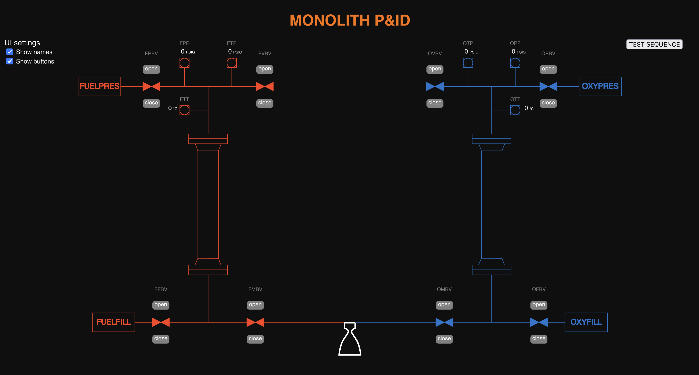

# Monolith-GUI

Reliable graphical control interface for Monolith, a liquid-propellant engine test stand of [PARSEC](https://www.parsec.caltech.edu/), the rocketry club at Caltech. Renders an interactive Piping & Instrumentation Diagram, and allows the controller to open or close any valves, read thermocouple and pressure values, and execute pre-determined sequences. There is also a monitor screen with real-time graphs. It was successfully used for a cold-flow test of the whole system.

## How it works

The Monolith-GUI is implemented as a multiprocess Python application, with one control loop communicating with the stand using [CAN](https://en.wikipedia.org/wiki/CAN_bus), and one UI loop serving a Flask server. The diagram is made using SVG and elements are made interactive using `onclick` listeners and a backend "API". Updates are pushed to the frontend using Server-Side Events. A message passing interface is used between the two processes. Sequences are specified in code, which along with an exposed control loop allows anyone to add threshold rules or other behavior in the future.